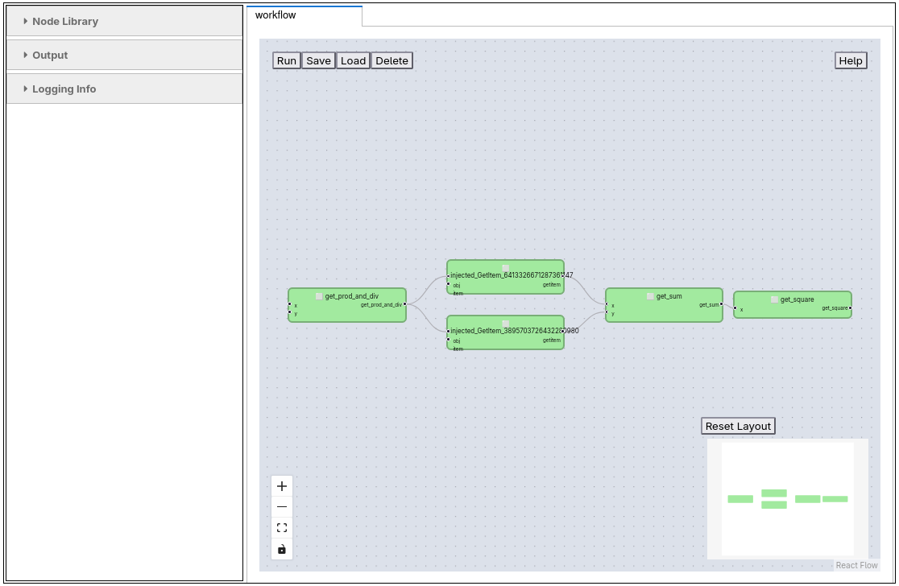

# Visual Programming
[](https://mybinder.org/v2/gh/pythonworkflow/visual-programming-with-pyironflow/HEAD)



Load the [Python Workflow Definition](https://pythonworkflow.github.io) with the visual programming environment [pyironflow](https://github.com/pyiron/pyironflow). 

```python
from pyironflow import PyironFlow
from python_workflow_definition.pyiron_workflow import load_workflow_json

PyironFlow([load_workflow_json(file_name="workflow.json")]).gui
```
